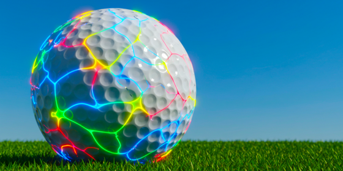

# NeuroGolf 2026



<p>
  
  
  
  
</p>

NeuroGolf 2026 is an ARC-style grid-reasoning competition where each task must be solved by an ONNX model. This repository documents a notebook-first solution workflow: explore the task distribution, measure solver opportunities, build a valid ONNX packaging baseline, then move toward evaluator-compatible input-derived solvers.

## 1. Project Snapshot

- Dataset coverage is complete: `400 / 400` normalized tasks.
- The benchmark is low-shot: median `3` training examples per task.
- Shape-changing tasks are significant: `138 / 400` tasks change shape in train pairs.
- Palette behavior is mixed: `176` same-palette tasks, `91` removes-color tasks, `86` introduces-color tasks, and `47` mixed palette-change tasks.
- Strict simple solvers explain a small first slice: `62` same-shape candidates and `4` simple shape-changing candidates.
- The first scorer-compatible submission is successful with a public score of `253.94`.
- The largest next queues are object movement/selection and crop/extract/compress.

## 2. Repository Structure

```text
.
├── README.md
├── docs/
│   ├── 1_instructions.md
│   ├── 2_eda_insights.md
│   ├── 3_baseline_models.md
│   ├── assets/
│   ├── coding-rules.md
│   └── figures/
└── notebooks/
    ├── 1_eda.ipynb
    ├── 2_baseline_models.ipynb
    ├── 3_solver_diagnostics.ipynb
    ├── 4_solver_development.ipynb
    └── 5_simple_solver_export.ipynb
```

The repository is intentionally notebook-first. Kaggle notebooks are the executable source of truth; `docs/` captures interpretation, results, and project decisions.

## 3. Notebook Workflow

| Notebook | Purpose | Current role |
| --- | --- | --- |
| `1_eda.ipynb` | Dataset profiling, visual task review, difficult-task gallery | Defines the modeling problem and evidence base |
| `2_baseline_models.ipynb` | Complete ONNX packaging baseline | Validates archive structure and fallback behavior |
| `3_solver_diagnostics.ipynb` | Strict solver checks and component diagnostics | Quantifies solver-family opportunities |
| `4_solver_development.ipynb` | Candidate tables for solver routing | Produces task-level next-action artifacts |
| `5_simple_solver_export.ipynb` | Scorer-compatible ONNX export | Generates rule-derived and score-oriented task models |

Recommended Kaggle run order:

1. Run `1_eda.ipynb` to refresh EDA outputs and figures.
2. Run `3_solver_diagnostics.ipynb` to refresh solver routing evidence.
3. Run `4_solver_development.ipynb` to export candidate tables.
4. Run `5_simple_solver_export.ipynb` to create the current scorer-compatible `submission.zip`.
5. Keep `2_baseline_models.ipynb` as a packaging reference and regression check.

## 4. Technical Skills

- Python notebook engineering for Kaggle execution.
- ARC-style grid analysis and symbolic rule diagnostics.
- Pandas and NumPy feature engineering for task-level metadata.
- Matplotlib visual diagnostics with ARC token palettes.
- ONNX graph construction with static tensor interfaces.
- ONNX Runtime validation and submission artifact checks.
- Rule-based solver design: color maps, constant rules, identity, spatial gather, and convolution candidates.
- Competition workflow hygiene: manifests, validation tables, lightweight docs, and reproducible notebook outputs.

## 5. Current Lessons

- Local ONNX Runtime validation is not enough. The Kaggle scorer rejected raw 2D `int64` grid models even when they ran locally.
- The scorer-compatible interface is static one-hot `float32` tensors with shape `[1, 10, 30, 30]`.
- A solved-task-only `submission.zip` is safer than a complete archive full of placeholder networks.
- Constant-output baselines are useful for packaging validation, but they are not a real solver strategy.
- The first successful public score, `253.94`, came from preserving the one-hot interface and writing only valid task models.
- Train-fit diagnostics need a second gate: public-output validation can reject rules that fit training pairs.
- Simple global rules are not enough. The largest unsolved queues require object movement/selection and crop/extract/compress reasoning.

## 6. Current Results

EDA and diagnostics:

- `400 / 400` tasks loaded.
- `386` single-test tasks and `14` multi-test tasks.
- `262` same-area tasks and `138` shape-changing tasks.
- `50` background-to-single-color candidates.
- `5` global color-map candidates.
- `4` strict simple shape-changing candidates.

Candidate routing from solver development:

- `158` tasks: object movement/selection
- `99` tasks: crop/extract/compress
- `62` tasks: simple same-shape export candidates
- `45` tasks: pattern/counting/global logic
- `32` tasks: expand/tile/construct
- `4` tasks: simple shape export candidates

Latest export direction:

- Version 5 of `5_simple_solver_export.ipynb` produced the first successful public score: `253.94`.
- The next notebook revision keeps input-derived rule solvers first, then adds a labeled public-output fallback for additional scored coverage.

## 7. Run Instructions

This project is designed to run on Kaggle with the NeuroGolf competition dataset attached.

Kaggle steps:

1. Open the target notebook under `notebooks/`.
2. Attach the NeuroGolf 2026 competition dataset.
3. Run all cells.
4. For submission, download `/kaggle/working/submission.zip`.
5. For analysis handoff, download the CSV manifests written under `/kaggle/working`.

Important outputs:

- `submission.zip`
- `simple_logic_manifest.csv`
- `neurogolf_solver_candidate_table.csv`
- `neurogolf_same_shape_solver_fits.csv`
- `neurogolf_shape_solver_fits.csv`
- EDA figures and summaries from notebook 1

## 8. Next Work

Immediate next step:

- Run the updated `5_simple_solver_export.ipynb` on Kaggle and compare its score against the `253.94` public baseline.

Modeling next steps:

1. Add exact object extraction and object selection diagnostics for the `158` object movement/selection tasks.
2. Split the `99` crop/extract/compress tasks into object crop, bounding-box crop, selected-object output, summary/count output, and fixed-template output.
3. Keep improving notebook 5 with scorer-compatible ONNX builders and transparent model-family labels.
4. Track `validation_scope` in every manifest row so rule-derived progress is separate from score-oriented fallback coverage.
5. Promote a solver family only when it validates on all available task pairs and survives Kaggle scoring.

Detailed notes:

- EDA evidence: `docs/2_eda_insights.md`
- Baseline and submission notes: `docs/3_baseline_models.md`
- Project rules: `docs/coding-rules.md`
