# EDA and Solver Diagnostics Insights

This note summarizes what the current EDA and solver-diagnostics notebooks tell us about the NeuroGolf 2026 task distribution. The goal is to turn notebook output into modeling decisions: which task families matter, which simple solvers are worth implementing first, and where deeper analysis is still needed.

## 1. Executive Summary

- Data coverage is complete: `400 / 400` normalized tasks are available.
- The benchmark is low-shot: the median task has `3` training examples, with a range from `2` to `10`.
- Shape-changing behavior is too common to defer: `138 / 400` tasks change shape in train pairs.
- Same-area tasks are still the majority: `262 / 400` tasks preserve approximate area.
- Color `0` dominates input and output cells, so background handling should be a core primitive.
- Strict simple solvers explain only a limited slice of the benchmark: `62` tasks for same-shape rules and `4` tasks for simple shape-changing heuristics.
- The strict solver slice is useful for first exports, but it leaves most tasks for object-level, crop/extract, construction, and pattern logic.
- The next modeling work should focus on object extraction, object movement/selection, crop/compress logic, and construction rules rather than broad learned models.

## 2. Data Health

- Input discovery is healthy: `800` JSON files were discovered.
- The loader normalized these into `400` tasks.
- Expected task coverage is complete: `task001` through `task400` are present.
- All loaded tasks include test outputs in the current public benchmark files.

Interpretation:

- Missing data is not currently a blocker.
- Downstream errors are more likely to come from ONNX generation, submission structure, evaluator constraints, or weak solver logic than from data loading.
- Complete task coverage also makes per-task manifests valuable because every modeling decision can be audited against the full expected id set.

## 3. Dataset Structure

Training examples are sparse:

- Median train examples per task: `3`
- Minimum train examples: `2`
- Maximum train examples: `10`

Test-case structure:

- `386` tasks have exactly one test case.
- `14` tasks have multiple test cases.

Interpretation:

- This is not a setting where conventional model training per task is attractive. There are too few examples.
- Rule induction, hypothesis search, symbolic transforms, and object-centric heuristics should be prioritized.
- The `14` multi-test tasks are operationally important because they expose whether a model truly conditions on the input or merely emits a fixed output.

## 4. Shape Behavior

Task shape categories from the structural deep dive:

- `262` same-area tasks
- `97` strong compression tasks
- `26` strong expansion tasks
- `10` mild expansion tasks
- `5` mild compression tasks

Shape-changing total:

- `138 / 400` tasks change shape in train pairs.

Interpretation:

- Same-shape solvers are necessary but not sufficient.
- Strong compression tasks likely involve crop, extract, summarize, count, select, or canonicalize operations.
- Strong expansion tasks likely involve tiling, scaling, drawing, completion, or construction.
- Shape-changing tasks should be handled as a separate solver track rather than as exceptions inside same-shape logic.

High-priority shape deep dives:

- Split strong compression tasks into crop-to-bounding-box, object extraction, summarization/counting, and fixed-template output.
- Split strong expansion tasks into nearest-neighbor scale, periodic tile, object replication, grid construction, and drawing/completion.
- Track whether output shape is fixed across train examples or derived from input geometry.

## 5. Color and Palette Behavior

Color `0` dominates both train inputs and outputs.

Palette relation across tasks:

- `176` same-palette tasks
- `91` removes-color tasks
- `86` introduces-color tasks
- `47` introduces-and-removes-color tasks

Interpretation:

- Same-palette tasks are more likely driven by geometry, movement, selection, or arrangement than by inventing new colors.
- Removes-color tasks often indicate filtering, object selection, masking, background normalization, or crop/extract behavior.
- Introduces-color tasks suggest marking, filling, completion, derived labels, or conversion from object relation to output annotation.
- Introduces-and-removes-color tasks are likely more compositional and should be treated as harder solver candidates.

High-priority color deep dives:

- Identify dominant background token per task rather than assuming `0` is always background.
- Separate color-map tasks from color-creation tasks.
- Measure whether introduced colors are constant across train pairs or derived from input colors.
- Compare input/output color counts against shape-change groups.

## 6. Simple Solver Coverage

Strict same-shape solver compatibility covers `62` tasks.

Same-shape diagnostic breakdown:

- `background_to_single_color`: `50`
- `global_color_map`: `5`
- `rotate_180`: `2`
- `transpose`: `2`
- `rotate_90`: `1`
- `flip_horizontal`: `1`
- `flip_vertical`: `1`
- `identity`: `0`
- `rotate_270`: `0`

Strict shape-changing heuristics cover only `4` tasks:

- `nearest_integer_scale`: `2`
- `crop_non_background`: `1`
- `periodic_tile_from_input`: `1`

Interpretation:

- Background-to-single-color is the strongest immediate baseline family.
- Pure global color maps exist but are not a large-enough strategy by themselves.
- Simple flips/rotations/transposes are rare as complete task explanations.
- The current crop/scale/tile checks are intentionally strict; low coverage does not mean these ideas are unimportant, only that naïve versions are insufficient.

## 7. Object Complexity

Connected-component diagnostics show a wide spread in object complexity.

High-component stress tasks include:

- `task110`
- `task205`
- `task017`
- `task305`
- `task074`

Interpretation:

- Low-component tasks are good candidates for object extraction, movement, selection, and relation solvers.
- High-component tasks likely require pattern, counting, grid-line, texture, or global-logic approaches.
- Component count alone is not enough. We also need object shape, bounding-box density, color grouping, and relative-position features.

Recommended object-level additions:

- Connected components by each non-background color.
- Bounding boxes, areas, aspect ratios, and compactness.
- Object preservation checks between input and output.
- Object movement vectors and alignment.
- Symmetry and repetition features.
- Grid-line detection and region segmentation.

## 8. Modeling Priority

Recommended solver tracks from diagnostics:

- `148` tasks: deep dive object movement/selection
- `101` tasks: deep dive crop/extract/compress
- `62` tasks: implement simple same-shape solver
- `52` tasks: deep dive pattern/counting/global logic
- `33` tasks: deep dive expand/tile/construct
- `4` tasks: implement simple shape solver

Recommended implementation order:

1. Background-to-single-color and global color-map solvers.
2. Object extraction, object movement, and object selection solvers.
3. Crop, extract, and compression solvers.
4. Expand, tile, and construct solvers.
5. Pattern, counting, grid-line, and global-logic diagnostics for high-component tasks.

## 9. Do We Need More Deep-Dive Analysis?

Yes, but it should be targeted rather than broad. The current EDA is enough to reject a purely generic modeling approach and enough to define the first solver families. The next notebook should first produce a solver candidate table, then use that table to decide which deep dives are worth doing. The next deep dives should be solver-enabling:

- For the `62` simple same-shape candidates, export exact task ids and expected solver family.
- For the `101` crop/extract/compress candidates, classify whether output is object crop, bbox crop, fixed template, count summary, or selected object.
- For the `148` object movement/selection candidates, compute object correspondences between train inputs and outputs.
- For the `33` expand/tile/construct candidates, classify scaling, tiling, replication, and drawing patterns.
- For the `52` pattern/counting/global-logic candidates, add grid-line, region-count, repetition, and symmetry diagnostics.

The immediate next notebook should therefore be solver-development oriented, not more descriptive EDA.

Current next-step artifact:

- `notebooks/4_solver_development.ipynb` creates train-fit candidate tables for simple same-shape and shape-changing solvers.
- It exports `neurogolf_solver_candidate_table.csv`, `neurogolf_same_shape_solver_fits.csv`, and `neurogolf_shape_solver_fits.csv`.
- It also writes `neurogolf_solver_development_artifacts.zip` so the candidate tables can be downloaded from Kaggle as one bundle.
- The following notebook after that should export the highest-confidence simple same-shape solvers to ONNX, starting with background-to-single-color and global color-map candidates.

Latest solver-development routing:

- `158` tasks: deep dive object movement/selection
- `99` tasks: deep dive crop/extract/compress
- `62` tasks: export simple same-shape solver
- `45` tasks: deep dive pattern/counting/global logic
- `32` tasks: deep dive expand/tile/construct
- `4` tasks: export simple shape solver

## 10. Report Figures

The EDA notebook now generates a small report asset pack under `eda_report_figures` when it runs. The generated files are designed to be copied directly into notes, README updates, or Kaggle writeups.

Generated figures:

- `1_pair_distributions.png`: train/test example counts.
- `2_grid_geometry.png`: input/output area and shape-change overview.
- `3_color_frequency.png`: ARC color-token frequency.
- `4_area_groups.png`: compression, same-area, and expansion groups.
- `5_palette_relation.png`: same-palette, introduced-color, removed-color, and mixed palette tasks.
- `6_sample_task.png`: rendered representative task sample from the diverse visual-review set.
- `7_difficult_strong_expansion.png`: hardest sampled strong-expansion task.
- `8_difficult_strong_compression.png`: hardest sampled strong-compression task.
- `9_difficult_largest_grid.png`: largest-grid stress task.
- `10_difficult_rich_palette.png`: richest-palette stress task.
- `11_difficult_multi_test.png`: multi-test task sample when available.

Selected EDA figures from the latest run:

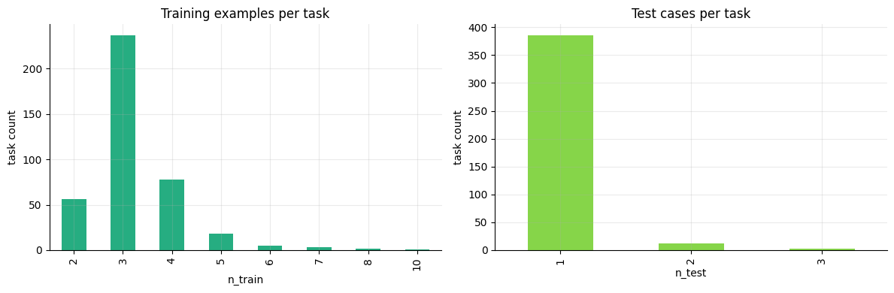

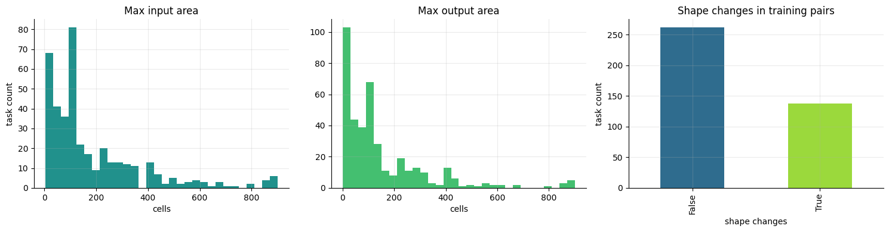

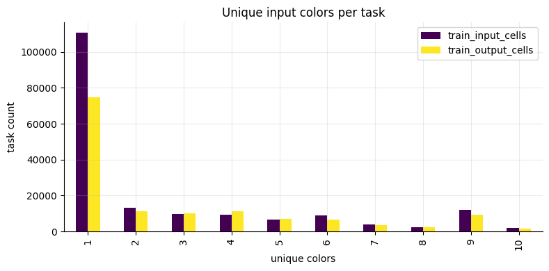

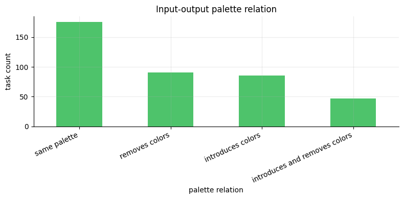

The EDA notebook also includes an inline difficult-task gallery in the task-review section. It renders representative stress cases for strong expansion, strong compression, large grids, rich palettes, multi-test behavior, and mixed palette changes before the modeling-planning section.

Latest difficult-task gallery:

- `task398`: strong expansion stress case.
- `task355`: strong compression stress case.
- `task054`: largest-grid stress case.
- `task022`: rich-palette stress case.
- `task399`: multi-test stress case.
- `task003`: mixed-palette stress case.

Latest difficult-task renders:

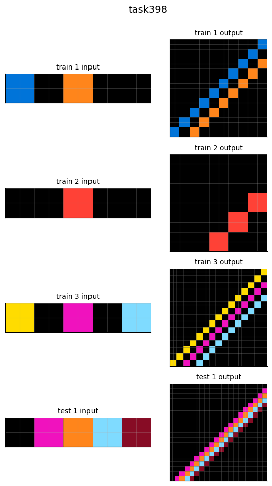

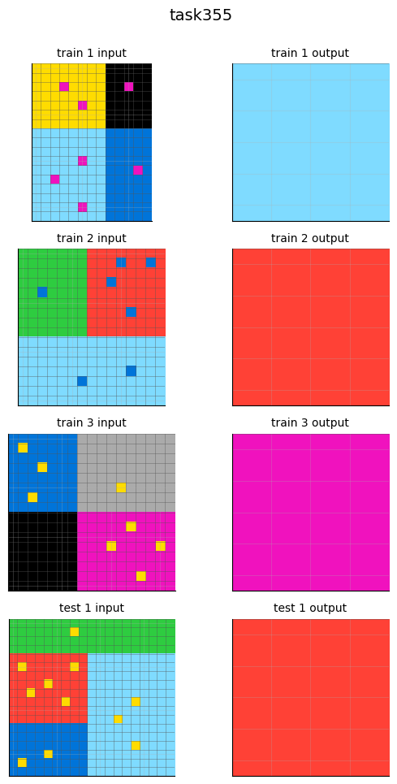

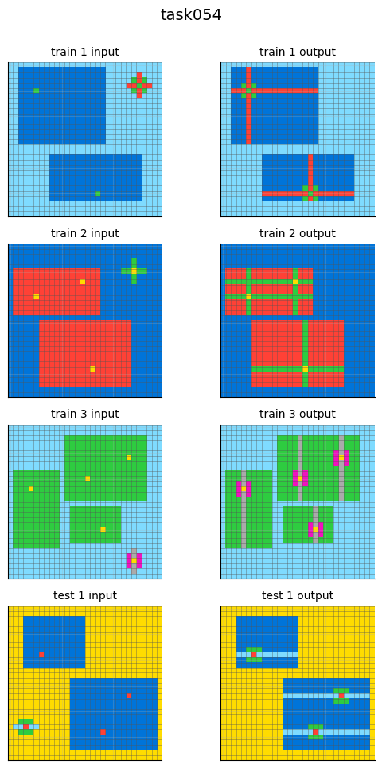

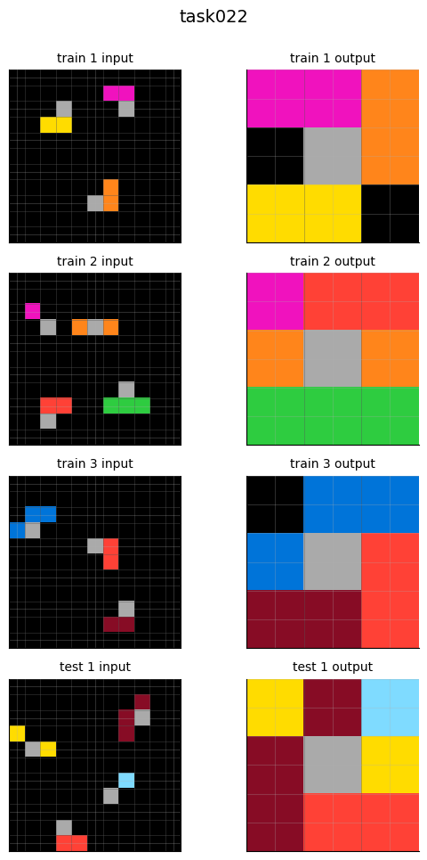

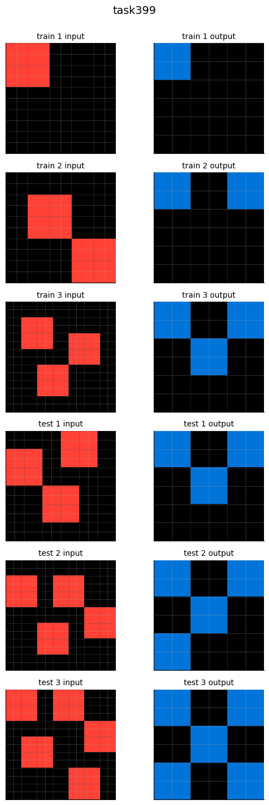

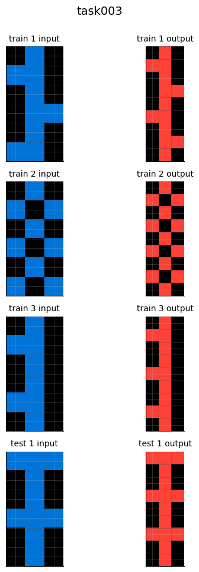

Modeling implication:

- `task398` and `task355` should anchor shape-changing solver design because they represent the strongest area-ratio extremes.
- `task054` should be used as an ONNX-size and runtime stress check before exporting any dense grid operation.
- `task399` should remain in the multi-test validation set because it exposes whether a model truly branches on input.
- `task003` is a good early mixed-palette example because it combines shape change with color replacement.

Solver planning view:

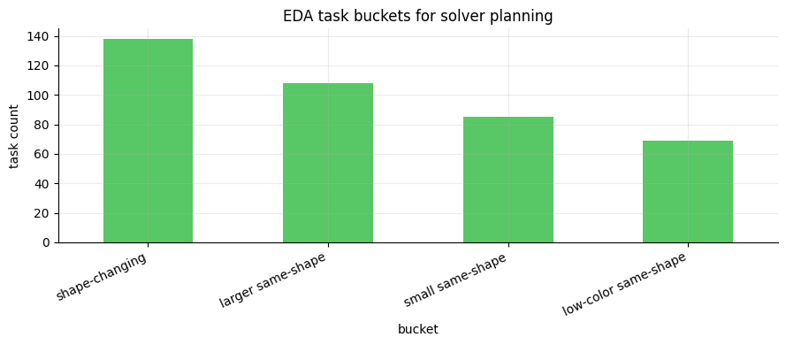

Generated markdown:

- `eda-insights-with-figures.md`: a markdown fragment with captions and image links.
- `eda_figure_manifest.csv`: a machine-readable manifest of figure titles, paths, and captions.

These plots are not just presentation artifacts. They should be used as a review checklist before implementing new solver families:

- Pair distributions confirm whether a solver can rely on multiple train examples.
- Grid geometry identifies where dynamic output shape is required.
- Color frequency keeps background logic visible.
- Area groups separate crop/compress solvers from expand/construct solvers.
- Palette relation separates geometry tasks from color-introduction tasks.
- Sample task renders keep the modeling discussion grounded in actual ARC examples.
- Difficult task renders make the next solver backlog concrete: expansion, compression, large-grid, rich-palette, and multi-test failure modes should each be inspected before implementing solvers.
